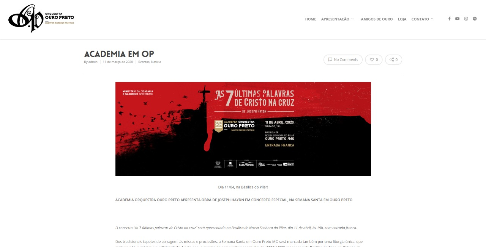
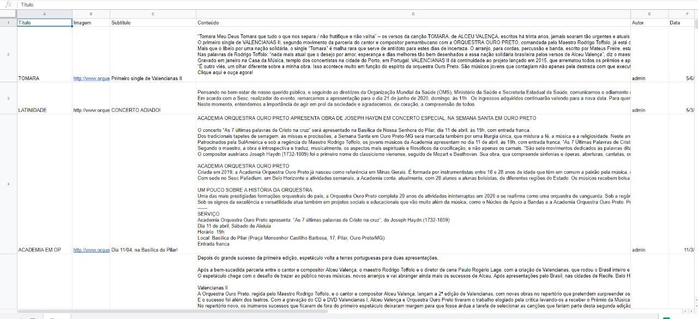

Projeto de Scraping utilizando Node.js, Yarn e Puppeteer para coleta de notícias no site Orquestra Ouro Preto. 

Como pode ser visto no [link]([http://www.orquestraouropreto.com.br/site/noticias/)](http://www.orquestraouropreto.com.br/site/noticias/), as notícias são organizadas na forma de cards.

Esses cards ao serem clicados levam para outra página, com mais informações. 

Nessa páginas são adquiridos os dados: título da notícia, subtítulo da notícia, autor da notícia, data de publicação, url da imagem em destaque e conteúdo.

Cada página possui 10 notícias, e é necessário caminhar pelas páginas, de forma a obter todas. 

O algoritmo, inicialmente, adquire as urls de todas as notícias disponíveis. O próximo passo é caminhar pelas urls selecionadas, aquirindo os dados citados acima, que são posteriormente salvos em um arquivo .csv que pode ser aberto por leitores de tabelas.

